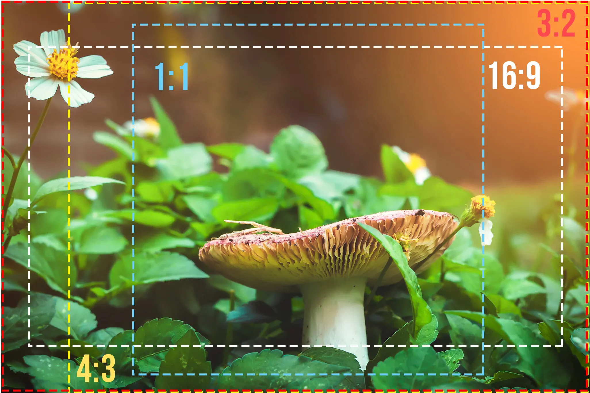
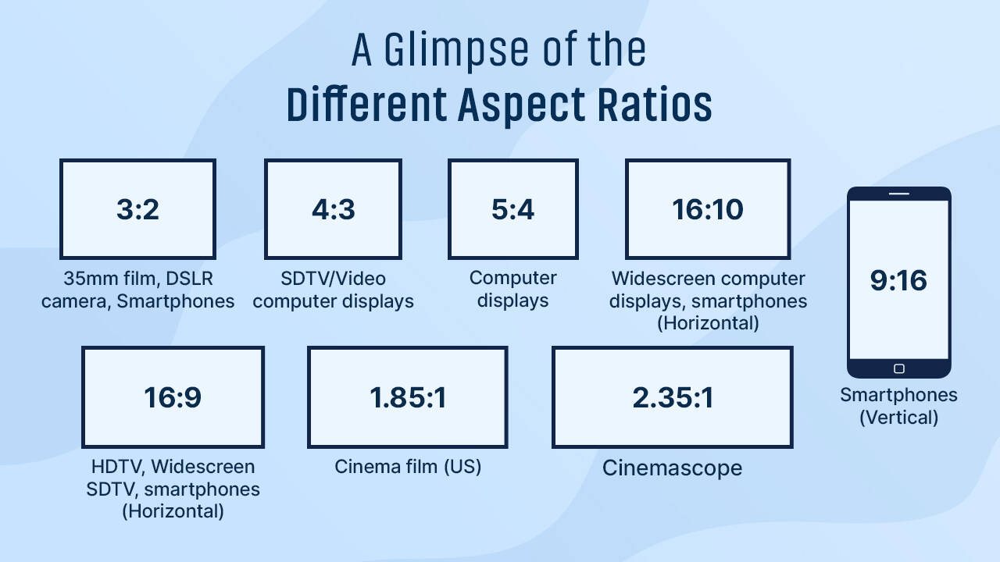
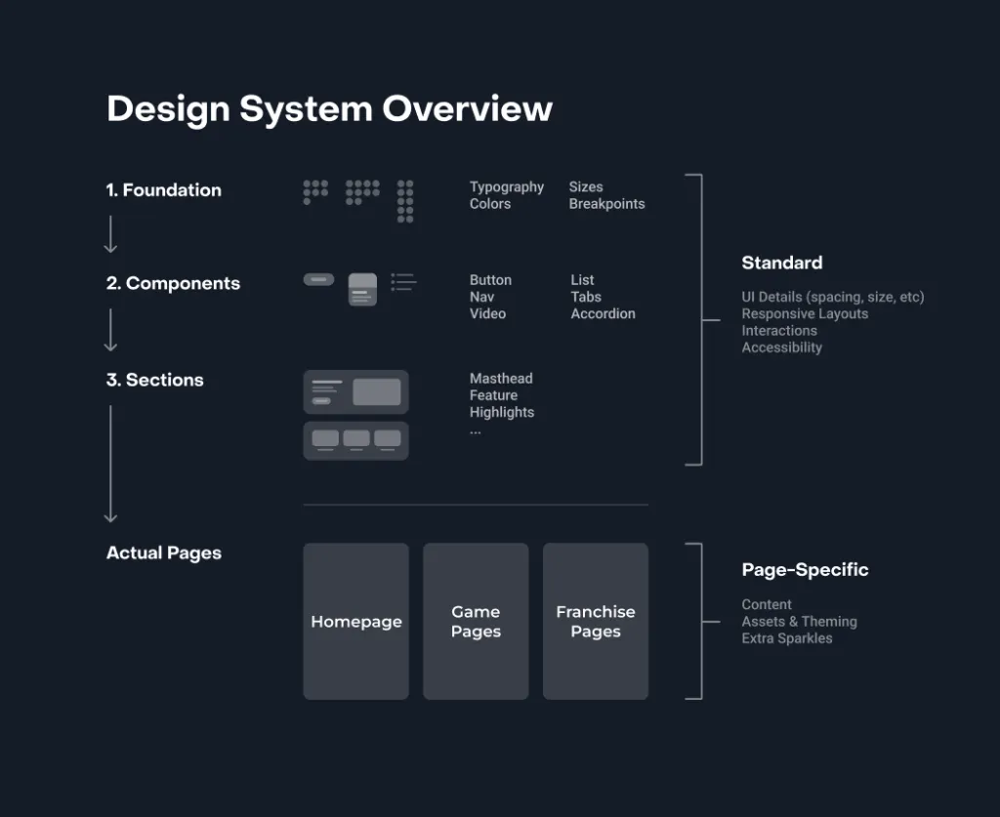
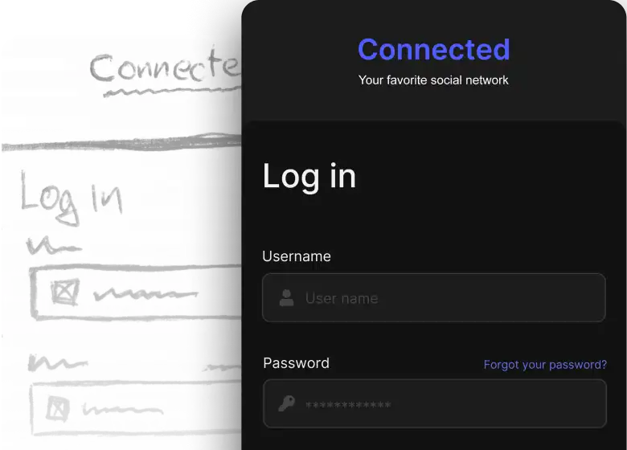

```
This guide includes quick references to important CSS concepts, generators to speed up development, libraries, and useful links for further reading.
```

or

```
This repository provides a comprehensive quick reference guide for various web development essentials, including responsive meta tags, favicons, CSS resets, and utility classes. It covers a range of topics such as:
```

- **Responsive Content Tag**: Ensuring optimal display on all devices.
- **Favicon**: Adding a recognizable icon to your website.
- **CSS Reset**: Standardizing default styles across browsers.
- **CSS Variables**: Using custom properties for maintainable and scalable styles.
- **Colors**: References to popular color palettes.
- **Fonts**: Importing and using web fonts effectively.
- **Font Icons**: Implementing scalable vector icons.
- **Media Queries**: Designing for different screen sizes.
- **Dark Mode**: Implementing a dark mode for your site.
- **Centered Content**: Centering elements with flexbox.
- **Cover Image**: Creating full-cover background images.
- **Cards**: Styling card elements with flat, neumorphic, and glassmorphic designs.
- **Flexbox and Grid Layouts**: Building responsive layouts with modern CSS techniques.
- **Shape Dividers and Filters**: Adding creative visual elements.
- **Animations**: Bringing your site to life with CSS animations.
- **Clipping Paths and Masks**: Creating complex shapes and visual effects.
- **Parallax Scrolling and Smooth Scrolling**: Enhancing user experience with scrolling effects.

This guide includes practical examples, references to generators and libraries, and links to further reading, making it a valuable resource for web developers looking to streamline their workflow.

<br>


## Table of Contents
1. [Responsive Design Workflow](#responsive-design-workflow)
2. [HTML Basics](#html-basics)
   - [HTML Template](#html-basic-template)
   - [HTML Tags](#html-basic-tags)
3. [CSS Basics](#css-basics)
   - [CSS Selectors](#css-selectors)
   - [CSS Properties](#css-basic-properties)
   - [CSS Units of Measure](#css-units-of-measure)
   - [CSS Variables](#css-variables)
   - [CSS Reset](#css-reset)
4. [Design & Layout](#design-layout)
   - [Colors](#colors)
   - [Fonts & Typography](#fonts-typography)
   - [Fonts Icons](#fonts-icons)
   - [Flexbox](#flexbox)
   - [Grid Layout](#grid-layout)
   - [Cards & Centered Content](#cards-centered-content)
5. [Advanced CSS Techniques](#advanced-css-techniques)
   - [Media Queries](#media-queries)
   - [Cover Image](#cover-image)
   - [Shape Divider](#shape-divider)
   - [Neumorphism](#neumorphism)
   - [Glassmorphism](#glassmorphism)
   - [Filters](#filters)
   - [Dark Mode](#dark-mode)
   - [Clipping Paths and Masks](#clipping-paths-masks)
   - [Animations](#animations)
6. [Additional Resources](#additional-resources)

## Responsive Design Workflow

1. Find inspirations on popular sites like Dribble ([Landing Page](https://dribbble.com/search/landing-page), [App Designs](https://dribbble.com/search/app-design)).
2. Design a Wireframe/Layout/Mockup for mobile and desktop devices (using pen & paper, or a popular tool like [Figma](https://www.figma.com/)).
3. Pick a color swatch.
4. Pick the fonts.
5. Implement the design (using vanilla CSS or a GUI design tool like [Webflow](https://webflow.com/)).
6. Add Content.
7. Add Animations.

## Chrome Dev Tools

- Element Selector
- CSS Live Editor
- Device Simulator

## HTML Basics

### HTML Basic Template

```html
<!DOCTYPE html>
<html lang="en">
<head>
    <meta charset="UTF-8">
    <meta name="viewport" content="width=device-width, initial-scale=1.0">
    <title>Document</title>
    <link rel="icon" href="icon.png">
    <style></style>
    <link rel="stylesheet" href="styles.css"> <!-- Link to external stylesheet -->
</head>
<body>
    
</body>
</html>
```

### Responsive Content Tag

```html
<meta name="viewport" content="width=device-width, initial-scale=1.0">
```

### Favicon

```html
<link rel="icon" href="favicon.ico" type="image/x-icon">
```

### HTML Basic Tags

```html
<h1>Main Heading</h1> 
<h2>Sub Heading</h2> 
<h3>Sub Sub Heading</h3> 
<h4>Heading level 4</h4>
<h5>Heading level 5</h5>

<div>Div 1</div>
<div>Div 2</div>
<div>Div 3</div>

<p>Paragraph 1</p>
<p>Paragraph 2</p>
<p>Paragraph 3</p>

 
 


<a href="https://example.com">Link 1</a> 
<a href="https://example.com">Link 2</a> 
<a href="https://example.com">Link 3</a> 

<span>Span 1</span>
<span>Span 2</span>
<span>Span 3</span>

<br/> 
&nbsp;
```

## CSS Basics

### CSS Selectors

```css
p, #id-name, .class-name, a:hover {}
```

```html
<div id="id-name"></div>

<div class="class-name another-class"></div>
<div class="class-name another-class"></div>
<div class="class-name another-class"></div>
```

What's the difference?

```css
div.class123, div .class123 {}
```

**Explanation**: 
- `div.class123`: Selects `div` elements with the class `class123`.
- `div .class123`: Selects elements with the class `class123` that are descendants of a `div` element.

### CSS Basic Properties

```css
/* Dimensions */
width: 200px; /* Sets width to 200px */
height: 100px; /* Sets height to 100px */
max-width: 100%; /* Sets maximum width to 100% of the parent element */
max-height: 100%; /* Sets maximum height to 100% of the parent element */

/* Typography */
font-family: Arial, sans-serif; /* Sets font family to Arial with a fallback to sans-serif */
font-size: 16px; /* Sets font size to 16 pixels */
color: #333; /* Sets text color to a dark gray */

/* Background */
background-color: #f0f0f0; /* Sets background color to a light gray */
background-image: url('background.jpg'); /* Sets a background image */
background-size: cover; /* Sets background image to cover the element */
background-position: center; /* Centers the background image */
background-repeat: no-repeat; /* Prevents background image from repeating */

/* Display */
display: block; /* Element will be displayed as a block */
display: inline; /* Element will be displayed inline */
display: inline-block; /* Element will be displayed as an inline-level block container */
display: none; /* Element will be hidden */
display: flex; /* Element will be displayed as a flexible box container */
display: grid; /* Element will be displayed as a grid container */

/* Visibility */
visibility: hidden; /* Element will be hidden but still take up space */
opacity: 0.5; /* Sets opacity to 50% */
z-index: 1000; /* Sets the stacking order */

/* Positioning */
position: relative; /* Element is positioned relative to its normal position */
position: absolute; /* Element is positioned absolutely to its nearest positioned ancestor */
position: fixed; /* Element is positioned relative to the browser window */
position: sticky; /* Element is positioned based on the user's scroll position */
top: 100px;
left: 100px;

/* Border */
border-style: solid; /* Sets border style to solid */
border-width: 2px; /* Sets border width to 2px */
border-color: black; /* Sets border color to black */

/* Spacing */
margin: 5px; /* Sets margin to 5px on all sides */
padding: 5px; /* Sets padding to 5px on all sides */
```

### CSS Units of Measure

px and % vs rem,em, and vh, vw

```text
px (pixels): The most commonly used unit. Represents a single dot on the screen.

% (percentage): Relative to the parent element's dimension.

rem: Relative to the root element (usually the `<html>` element).

em: Relative to the font size of the element itself.

vh (viewport height): Relative to 1% of the height of the viewport.

vw (viewport width): Relative to 1% of the width of the viewport.
```

**Tip**: 100vh/vw will always represent the full height/width of the viewport, while 100% will depend on the height/width of the parent element.

### CSS Variables

**Reference**: [CSS Variables on MDN](https://developer.mozilla.org/en-US/docs/Web/CSS/Using_CSS_custom_properties)

```css
:root { --primary: #1e90ff; }

body { background-color: var(--primary); }
```

```css
:root {
    --primary-color: #FF6347;          /* A vibrant tomato red for primary actions */
    --secondary-color: #4682B4;        /* A steel blue for secondary elements */
    --background-color: #F8F9FA;       /* A light gray background for a clean look */
    --text-color: #212529;             /* Dark gray text for good readability */
    --font-family: 'Roboto', sans-serif; /* Using font family as Roboto for its modern look */
    --font-size: 16px;                 /* Base font size */
}
```

### CSS Reset

```css
/* Reset CSS */
* {
    margin: 0;
    padding: 0;
    box-sizing: border-box;
}

a { text-decoration: none; color: black; }
```


## Design & Layout

### Colors

**Reference**: [Flat UI Colors](https://flatuicolors.com/), [Color Palette](https://flatuicolors.com/palette/defo)

**Generator**: [Real-time Colors](https://www.realtimecolors.com/?colors=e8f5ec-0b180f-a2d4b3-36316b-ae71be&fonts=Inter-Inter)

### Fonts & Typography

**Source**: [Google Fonts](https://fonts.google.com/)

**Inspiration**: [Fontjoy](https://fontjoy.com/), [Monotype Font Pairing](https://www.monotype.com/font-pairing#/playground)

```css
@import url('https://fonts.googleapis.com/css2?family=Roboto:wght@300&display=swap');

body{ font-family:'Roboto'; }

/* 
rem: Relative to the root element
em: Relative to the parent element 

  <!-- 100vh will always represent the full height of the viewport, while 100% will depend on the height of the parent element. -->
  <!-- Grid provides control over both columns and rows, whereas Flexbox focuses on either the horizontal (main) axis or the vertical (cross) axis. Grid for layouts. Flexbox for groupings like icons, cards, etc. -->
*/
```

```html
<link href="https://fonts.googleapis.com/css2?family=Roboto:wght@400;700&display=swap" rel="stylesheet">
```

# Fonts Icons
**Source** [Ionicons](https://ionic.io/ionicons) 

```html
<script type="module" src="https://unpkg.com/ionicons@7.1.0/dist/ionicons/ionicons.esm.js"></script>
<script nomodule src="https://unpkg.com/ionicons@7.1.0/dist/ionicons/ionicons.js"></script>
```

```html
<ion-icon name="heart"></ion-icon>
```

```css
ion-icon {font-size: 4rem;}
```

### Flexbox

**Reference**: [A Complete Guide to Flexbox](https://css-tricks.com/snippets/css/a-guide-to-flexbox/)

**Generator** [Flexbox Generator](https://www.cssportal.com/css-flexbox-generator/

**Quick Reference**:

```css
.flex-container {
  display: flex; /* or inline-flex */
  flex-direction: row | row-reverse | column | column-reverse;
  flex-wrap: nowrap | wrap | wrap-reverse;
  flex-flow: column wrap;
  justify-content: flex-start | flex-end | center | space-between | space-around | space-evenly;
  align-items: stretch | flex-start | flex-end | center | baseline;
  /* align-content only takes effect on multi-line flexible containers */
}
```

### Grid Layout

**Reference**: [CSS Grid Layout Guide](https://css-tricks.com/snippets/css/complete-guide-grid/)

**Generator** [CSS Grid Generator](https://grid.layoutit.com/)

**Quick Reference**:

```css
.grid-container {
  display: grid;
  grid-template-columns: 50px 50px repeat(2,1fr);
  grid-template-rows: auto;
  grid-template-areas: 
  "header header header header"
  "main main . sidebar"
  "footer footer footer footer";

  column-gap: 10px; row-gap: 10px; /*optional*/
  justify-items: start | end | center | stretch;
  align-items: start | end | center | stretch;
}
```

```css
.item-a {grid-area: header;} .item-b {grid-area: main;} .item-c {grid-area: sidebar;} .item-d {grid-area: footer;}
```

```html
<div class="container">
<div class="item-a"></div>
<div class="item-b"></div>
<div class="item-c"></div>
<div class="item-d"></div>
</div>
```

```
Grid provides control over both columns and rows, whereas Flexbox focuses on either the horizontal (main) axis or the vertical (cross) axis.

Grid for layouts. Flexbox for groupings like icons, cards, etc.
```


### Cards & Centered Content

**Reference**: [Responsive Card Design](https://css-tricks.com/responsive-card-design-flexbox/)

**Quick Reference**:


```css
.card {
    background-color: white;
    border-radius: 10px;
    box-shadow: 0 4px 8px rgba(0, 0, 0, 0.1);
    padding: 20px;
    max-width: 300px;
    margin: auto;
}
```

### Centered Content Utility Class

```
.center-content {
    display: flex;
    justify-content: center;
    align-items: center;
    height: 100vh;
}
```

## Advanced CSS Techniques

### Media Queries

**Reference**: [MDN Media Queries](https://developer.mozilla.org/en-US/docs/Web/CSS/Media_Queries/Using_media_queries)

```css
/* Design for Mobile First for faster mobile load times @media for larger screens */

/* and (orientation: landscape) */

/* Typical Device Breakpoints */ 
@media only screen and (max-width: 600px) {   }/* Extra small devices (phones, 600px and down) */
@media only screen and (min-width: 600px) {   }/* Small devices (portrait tablets and large phones, 600px and up) */
@media only screen and (min-width: 768px) {   }/* Medium devices (landscape tablets, 768px and up) */
@media only screen and (min-width: 992px) {   }/* Large devices (laptops/desktops, 992px and up) */
@media only screen and (min-width: 1200px) {   }/* Extra large devices (laptops/desktops, 1200px and up) */
```

```html
<link rel="stylesheet" media="screen and (max-width: 600px)" href="smallscreen.css">
```

### Cover Image

```css
.cover-image {
    width: 100%;
    background: url('image.jpg') no-repeat center center/cover;
}
```
or

```css
.cover-image {
    width: 100%;
    background-image: url('bg.webp'); 
    background-size: cover;  
    background-position: center; 
    }
```

```html
<div class="cover-image" style="height: 70vh;"> 
```

### Shape Divider

**Generater 1** [Shape Divider](https://www.shapedivider.app/) - HTML must be copied into div with curves, and that div's position should be made relative.

**Generater 2**: [Get Waves](https://getwaves.io/)

### Nuemorphism

**Generator** [Nuemorphism Generator](https://neumorphism.io/#e0e0e0)

```css
.neumorphicCard{
    width:25vw;height:25vw; border-radius: 57px;

    background: linear-gradient(145deg, #f1eaea, #cbc5c5);
    box-shadow:  19px 19px 37px #a9a4a4, -19px -19px 37px #ffffff;
}
```

### Glassmorphism

**Generator** [Glassmorphism Generator](https://hype4.academy/tools/glassmorphism-generator)

```css
.glassmorphicCard{   
  width:25vw;height:25vw; border-radius: 57px;

  background: rgba( 255, 255, 255, 0.25 );
  box-shadow: 0 8px 32px 0 rgba( 31, 38, 135, 0.37 );
  backdrop-filter: blur( 4px );
  -webkit-backdrop-filter: blur( 4px );
  border-radius: 10px;
  border: 1px solid rgba( 255, 255, 255, 0.18 );
}
```

### Filters

**Reference** [W3 Ref](https://www.w3schools.com/cssref/css3_pr_filter.php), [W3 Ref 2](https://www.w3schools.com/cssref/css3_pr_backdrop-filter.php)

**Generator** [Filter Generator 1](https://cssgenerator.org/filter-css-generator.html), [Filter Generator 2](https://front-end-tools.com/en/generateBackDropFilter/)

```css
filter/backdrop-filter: none | blur() | brightness() | contrast() | drop-shadow() | grayscale() | hue-rotate() | invert() | opacity() | saturate() | sepia() | url();

img {
  filter: blur(35px) drop-shadow(8px 8px 10px gray);
}
```

### Dark Mode

**Reference** [Ref](https://css-tricks.com/a-complete-guide-to-dark-mode-on-the-web/)

```css
body {
  background-color: white;
  color: black;
}

.dark-mode {
  background-color: black;
  color: white;
}
```

```js
function myFunction() {
   var element = document.body;
   element.classList.toggle("dark-mode");
} 
```

### Clipping Paths and Masks

**Generator** https://bennettfeely.com/clippy/, https://www.google.com/search?q=Editing+PNG+Mask+Layer&udm=2

**Reference** https://www.w3schools.com/css/css3_masking.asp , https://www.w3schools.com/css/css3_masking.asp 

```css
clip-path: circle(50% at 50% 50%);
```

### Aspect Ratio

**Reference** https://www.w3schools.com/cssref/css_pr_aspect-ratio.php






### Shadows

**Generator** https://cssgenerator.org/box-shadow-css-generator.html

### Parallax Scrolling

**Reference**: [Ref](https://www.w3schools.com/howto/howto_css_parallax.asp)

```css
.parallax {
    background-image: url('path-to-image.jpg');
    min-height: 400px;
    background-attachment: fixed;
    background-position: center;
    background-repeat: no-repeat;
    background-size: cover;
}
```

### Smooth Scrolling

For a scrolling box when scrolling is triggered by the navigation or CSSOM scrolling APIs.

```css
html {
    scroll-behavior: smooth;
}
```

### Animations

**Reference** https://www.w3schools.com/css/css3_animations.asp

**Generator** https://webcode.tools/css-generator/keyframe-animation

**Library**   https://animate.style/, https://michalsnik.github.io/aos/ (Animate On Scroll Library), https://useanimations.com/ (Micro-animations)

```css
@keyframes fadeIn {
    from { opacity: 0; }
    to { opacity: 1; }
}

.fade-in {
    animation: fadeIn 2s ease-in-out;
}
```

## Site Building Blocks



Example sections:

- Hero Section
- Features / Benefits
- Call-To-Action (CTA)
- Testimonials / Reviews
- Success Stories / Case Studies
- About Us
- Comparison Section
- Pricing / Plans
- FAQ
- Contact Section
- Footer
- How It Works
- Statistics / Metrics
- Portfolio / Showcase
- Team Section
- Newsletter Signup
- Blog / Resources
- Partners / Clients
- Timeline / Roadmap
- Gallery / Screenshots
- Awards / Certifications
- Trust & Security
- Product Demo / Interactive Demo
- Community Section
- Events Calendar
- Leaderboards
- Careers / Opportunities
- Press / Media Coverage
- Mission & Vision
- Sustainability / Impact
- Feature Highlights
- Use Cases
- Industries Served
- Customer Journey
- Process Workflow
- Roadmap & Future Plans
- Sponsors & Supporters
- Mentors & Advisors
- Project Showcase
- Idea Showcase
- Featured Products / Services
- Popular Categories
- Tutorials & Guides
- Social Media Feed
- Podcast Section
- Video Library
- Latest News
- Announcements
- Upcoming Events
- Membership Benefits
- Affiliate Program
- Referral Program
- Donation Section
- Volunteer Opportunities
- Partner Applications
- Surveys & Polls
- Feedback & Suggestions
- SDG Goals Section
- Interactive Map

## Agentic Design

- 
- 
- 
- 

- use ref images
- use ref site urls
- use hand-drawn sketches
- generate DESIGN.md from images, sites, etc. and extract/cutomize parts
-




### DESIGN.md
https://stitch.withgoogle.com/docs/design-md/overview

**Specification:** https://stitch.withgoogle.com/docs/design-md/specification  
**Skill:** https://github.com/google-labs-code/stitch-skills  
**Collection:**   
https://getdesign.md/  
https://github.com/voltagent/awesome-design-md

Agent native, human readable markdown file to define your design language and system, to get better, more consistent output, stop the AI from guessing.

```
A DESIGN.md file has two layers. The YAML front matter contains machine-readable design tokens — the precise values agents use to enforce consistency. The markdown body provides human-readable design rationale organized into ## sections. Prose may use descriptive color names (e.g., “Midnight Forest Green”) that correspond to systematic token names (e.g., primary). The tokens are the normative values; the prose provides context for how to apply them.

The spec is a foundation, not a prescription.
```

**Meet DESIGN.md: A new open standard for AI-generated UI** Google for Developers and Google Labs  
https://www.youtube.com/watch?v=W1gWIQp9k1Y&loop=0

**Your AI UI Looks Generic… This Fixes It (DESIGN.md)** Better Stack
https://www.youtube.com/watch?v=pY52H5gKhGg&loop=0

**Brands' Design.md Repo:** https://github.com/VoltAgent/awesome-design-md

### Google Stitch

A chatbot for generating UI designs

**Ad:** https://www.youtube.com/watch?v=nuJvDXZ9VVU&loop=0  
**Tutorial 1:** https://www.youtube.com/watch?v=3FIRNGJh00w&loop=0  
**Tutorial 2:** https://www.youtube.com/watch?v=8gkFn5Z-IvY&loop=0


## Additional Resources

### Accessibility in Responsive Design

**Reference**: [Web Accessibility Guide](https://www.w3.org/WAI/tips/designing/)

**Key Concepts**:
- Ensure text is readable with sufficient contrast.
- Make sure the website is navigable using a keyboard.
- Use ARIA roles to define element roles clearly for assistive technologies.

### CSS Frameworks

**Reference**: [Bootstrap](https://getbootstrap.com/), [Tailwind CSS](https://tailwindcss.com/)

This version should be more organized and user-friendly, with corrections and additional helpful content.

### Charting

**Reference** [Ref](https://www.highcharts.com/)


# UI/UX Design Reference


## Workflow

Collect inspirations
Filter inspiration ideas
Sitemap
Wireframe
Styleguide
Design samples
Create master layout and component library + documentation
Implement Design and build product

## Design Lingo
 
Emotion centric UX
Minimalism
3D and motion
Microinteractions

Glassmorphic
Pnuemorphic


